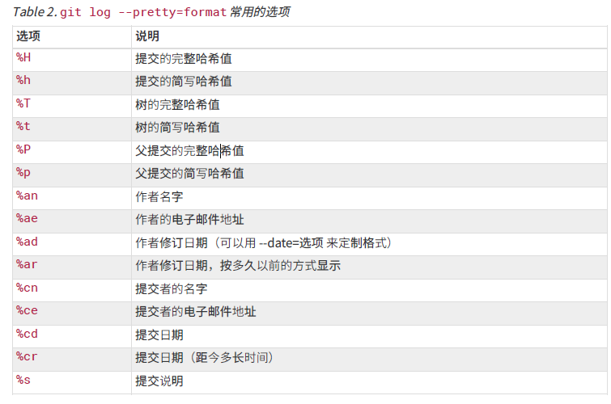
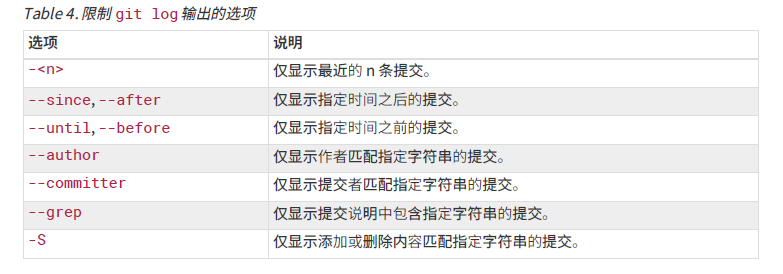

# 通过以下命令查看所有的配置以及它们所在的文件
git config --list --show-origin
# 列出所有 Git 当时能找到的配置
git config --list

# 使用git config 查看或修改配置，使用--global全局修改
# 查看
git config --list
# 修改
git config --global user.name "John Doe"
git config --global user.email johndoe@example.com
# 保存用户名密码
git config --global credential.helper store 

# 获取帮助（找到 Git 命令的综合手册（manpage）：）
git <verb> --help
git help config
# 如果你不需要全面的手册，只需要可用选项的快速参考，那么可以用 -h 选项获得更简明的 “help” 输出
git add -h
git config -h

###### git and github ######

# 本地Git仓库和Github仓库之间的传输是通过SSH加密
# 创建SSH KEY
ssh-keygen -t rsa -C "youremail@example.com"

# create a new repository on the command line
git init
git add README.md
git commit -m "first commit"
git remote add origin https://github.com/ThelemeGrand/GitStudy.git
git push -u origin master

# push an existing repository from the command line
git remote add origin https://github.com/ThelemeGrand/GitStudy.git
git push -u origin master

# 克隆仓库的命令
git clone https://github.com/ThelemeGrand/GitStudy.git
# 克隆到指令新的目录
git clone https://github.com/ThelemeGrand/GitStudy.git newfolder

# 直接提交（已经配置好）
git push origin master

###### end #######

###### 版本控制 ######

# 对项目目录添加git版本控制
git init

# 指定添加文件（添加所有、某一类型、某一文件）
git add .
git add *.md
git add LICENSE

# 提交到仓库
git commit -m '******'

# 检查当前文件状态
git status
# 状态简览
git status --short

# 查看已暂存和未暂存的修改
# 比较的是工作目录中当前文件和暂存区域快照之间的差异。 也就是修改之后还没有暂存起来的变化内容
git diff
# 查看已暂存的将要添加到下次提交里的内容, 也就是比对已暂存文件与最后一次提交的文件差异
git diff --staged
git diff --cached

# 跳过使用暂存区域, 直接提交
git commit -a -m '****'

# 删除文件
git rm test.md
# 要删除之前修改过或已经放到暂存区的文件，则必须使用强制删除选项 -f
git rm test.md -f
# 把文件从 Git 仓库中删除（亦即从暂存区域移除），但仍然希望保留在当前工作目录中
git rm --cached test.md

# 移动文件
git mv file_from file_to
# 直接手动删除文件显示：file_from删除，file_to添加。相当于运行三条命令
mv file_from file_to
git rm file_from
git add file_to

# 查看提交历史
git log
# 显示每次提交所引入的差异（按 补丁 的格式输出）
git log --patch
# 只显示最近的两次提交
git log -p -2
# 每次提交的简略统计信息
git log --stat
# 使用不同于默认格式的方式展示提交历史, oneline 会将每个提交放在一行显示
git log --pretty=oneline
git log --pretty=format
git log --pretty=format:"%h - %an, %ar : %s"
# 列出最近两周的所有提交
git log --since=2.weeks

# 重新提交
git commit --amend

# 取消暂存的文件
git reset HEAD <file>...
